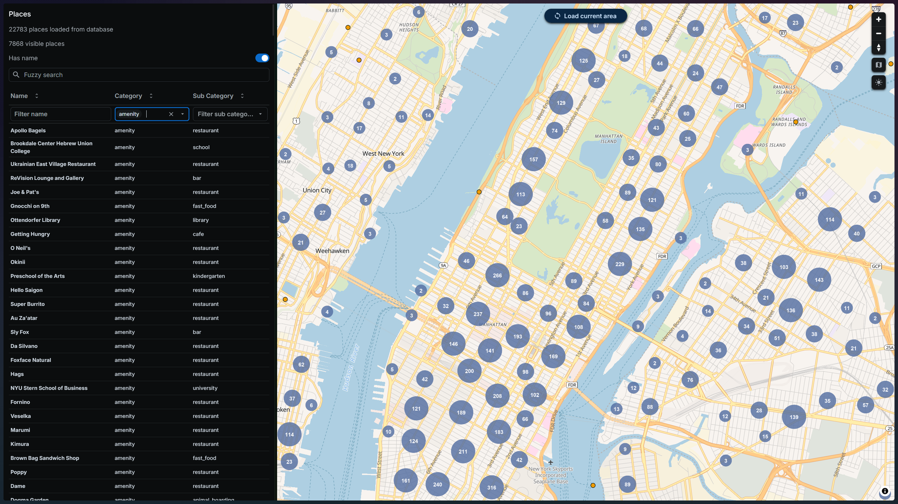

# All Places

Find the place you're looking for. Explore every place in any area with powerful filters and sorting, beyond the limits of traditional map apps.



## Tech stack

- UI: React + TypeScript + Joy UI + Material Icons + MapLibre GL, served by Nginx
- API: Go + Gin REST API
- Database: PostgreSQL
- Runtime: Docker Compose

## Repo layout

- apps/ui
- apps/api
- apps/osm-ingest-worker
- apps/database
- deploy/docker-compose

## Run locally

1. From repo root:

```bash
docker compose -f deploy/docker-compose/docker-compose.yml up --build
```

2. Open:
- UI: http://localhost:8080
- API health: http://localhost:8081/health
- Postgres: localhost:5432

## Manual OSM Ingest Worker

Build the worker image from the repo root:

```bash
docker build -t osm-ingest-worker ./apps/osm-ingest-worker
```

Run the worker manually, mounting a local extract file:

bash:
```bash
MY_DATA_PATH=$(pwd)/new-york-latest.osm.pbf
docker run --rm \
	-e PGPASSWORD=allplaces \
	-v $MY_DATA_PATH:/data/data.osm.pbf \
	--network allplaces_default \
	osm-ingest-worker
```

pwsh:
```pwsh
$MY_DATA_PATH = "$(pwd)/new-york-latest.osm.pbf"
docker run --rm `
	-e PGPASSWORD=allplaces `
	-v ${MY_DATA_PATH}:/data/data.osm.pbf `
	--network allplaces_default `
	osm-ingest-worker
```


Optional overrides for `ingest.sh` used by osm-ingest-worker:

- `DB_HOST` (default `db`)
- `DB_PORT` (default `5432`)
- `DB_USER` (default `allplaces`)
- `DB_NAME` (default `allplaces`)
- `DB_SCHEMA` (default `osm`)
- `OSM2PGSQL_PROCESSES` (default `4`)
- first arg: input file path (default `/data/data.osm.pbf`)

After the worker finishes, rebuild the app-facing `osm_places` table from `osm.planet_osm_point`:

pwsh:
```pwsh
.\deploy\docker-compose\rebuild-osm-places.ps1
```

That script runs [apps/database/scripts/rebuild_osm_places.sql](apps/database/scripts/rebuild_osm_places.sql) against the `db` service and recreates `osm_places` with the app's query-oriented schema.

Download osm extract files from https://download.geofabrik.de/index.html

## Core app behavior

- Data is loaded into PostGIS by the manual `osm-ingest-worker`, then projected into `osm_places` by the rebuild script.
- API reads prebuilt places from `osm_places` for the current viewport.
- Map always renders DB places for current viewport, with clustering.
- Left flyout list shows the same viewport results.
- Filters are instant and local: debounced name search, category, has-name-only, and fuzzy search.
- Light and dark modes are available from the top bar toggle.

## Fuzzy search

The fuzzy search input in the UI searches each place's full metadata as substring matches.

How it works:

1. The query is split into words by whitespace.
2. For each place, searchable fields are built from:
	- place name
	- place category
	- every projected OSM attribute in `tags` (strings directly, numbers/booleans as text, objects as JSON)
3. A term matches a field when it appears as a consecutive substring of that field (case-insensitive).
4. Multi-word queries are OR-ed: a place is included if **any** term matches **any** field.
5. Fuzzy search is combined with all other filters (has-name, name, category, sub-category).

Examples:

- Query `par` matches field `park` (consecutive substring).
- Query `food park` returns places matching `food` OR `park`.
- Query `food` does not match `park`.
- Query `prk` does not match `park` (letters not consecutive).
